Ref: https://web.archive.org/web/20240422070038/https://ai4bharat.iitm.ac.in/data-collection/

# Data Collection : Bridging Language Gaps for a Digital Tomorrow

The data collection efforts at our research lab are supported by a generous grant from the Ministry of Electronics and Information Technology, Government of India through the ambitious Digital India Bhashini Mission. Prof. Mitesh M. Khapra who heads the AI4Bharat research group also serves as the PI for the the Data Management Unit of Bhashini which is responsible for building the largest datasets for Indian languages across different verticals: machine translation, automatic speech recognition, speech synthesis and optical character recognition.

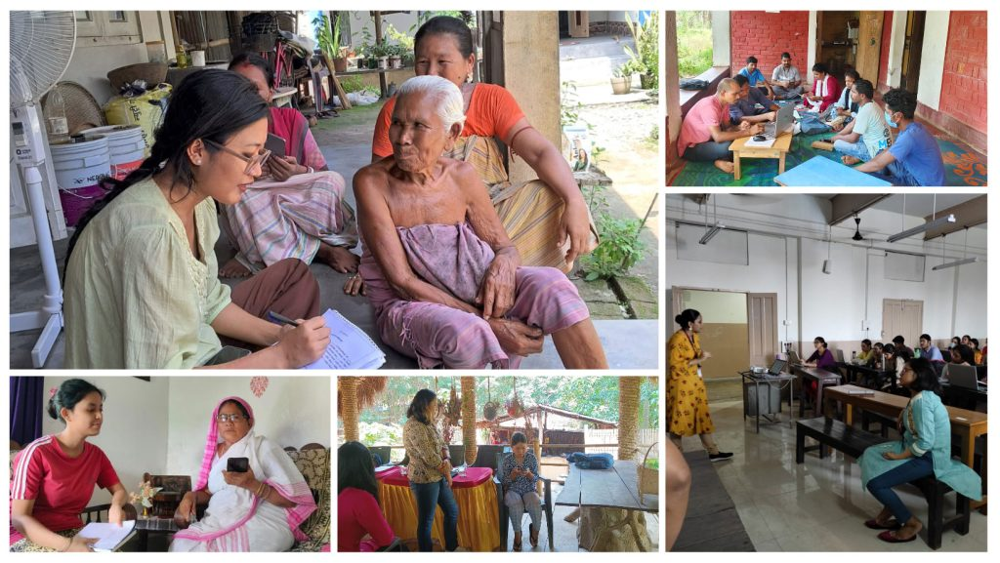

## Assamese Voices Unite: Kamrup's Language Preservation Drive
In the heart of Mirza, Kamrup District, the AI4Bharat Pilot team orchestrated the "Assamese Data Collection" workshop from Dec 5, 2022, to Jan 15, 2023. Held in a central hotel, this initiative saw diverse participants, guided by resource persons from institutes like DIET, Kamrup. Coordinated in separate rooms, 5-6 participants at a time enthusiastically contributed to the pilot data collection. The community's dedication shone through as participants not only engaged actively but also brought others to join, creating a vibrant tapestry of linguistic unity in action.

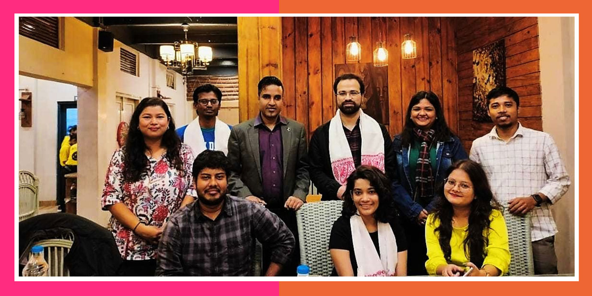

## Diverse Corners, One Language: Assamese Data Collection Spreads Across Kamrup Metro
In a big language project, the AI4Bharat team organized the "Assamese Data Collection" workshop in various neighborhoods in Kamrup Metro District from May 4 to May 24, 2023. The data gathering took place in VIP, Azara, Jalukbari, Beltola, Garchuk, and Narengi, strategically choosing participants' homes in Beltola, Rukminigaon, Garchuk, and Narengi amidst Guwahati's construction boom to make things more convenient. This decentralized approach aimed to get more people involved while saving time on transportation. Even without a photo link, the hard work of previous coordinators in finding suitable participants and recording their language contributions tells the story of a community-driven effort actively contributing to preserving the Assamese language.

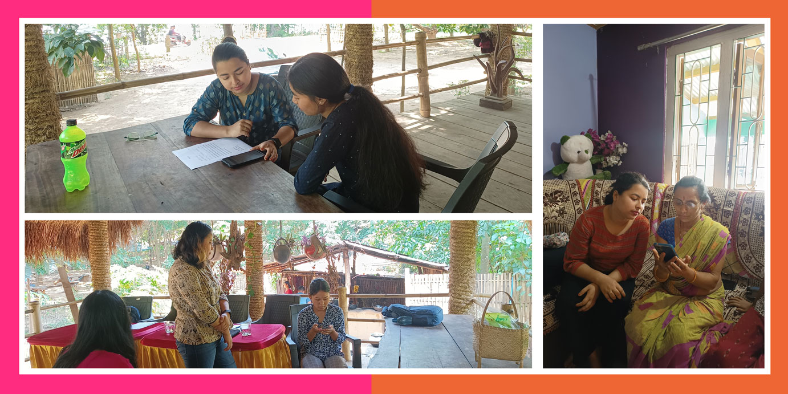

## Empowering Students, Enriching Culture: Assamese Data Collection Flourishes in North Lakhimpur
In the heart of North Lakhimpur District, the AI4Bharat team led the "Assamese Data Collection" workshop from June 18 to July 22, 2023. By providing thorough training to graduate and post-graduate students, the initiative smoothly covered various areas like Singimari, Gohain Tekela, Panigaon, Kadam, Narayanpur. Coordinators went to participants' homes for data collection. The collaboration with the local institution Gramyanubhuti, facilitated by Mr. Dikpal Lahan, played a crucial role in finding suitable participants—a testament to the strength of community-driven efforts in preserving the Assamese language.

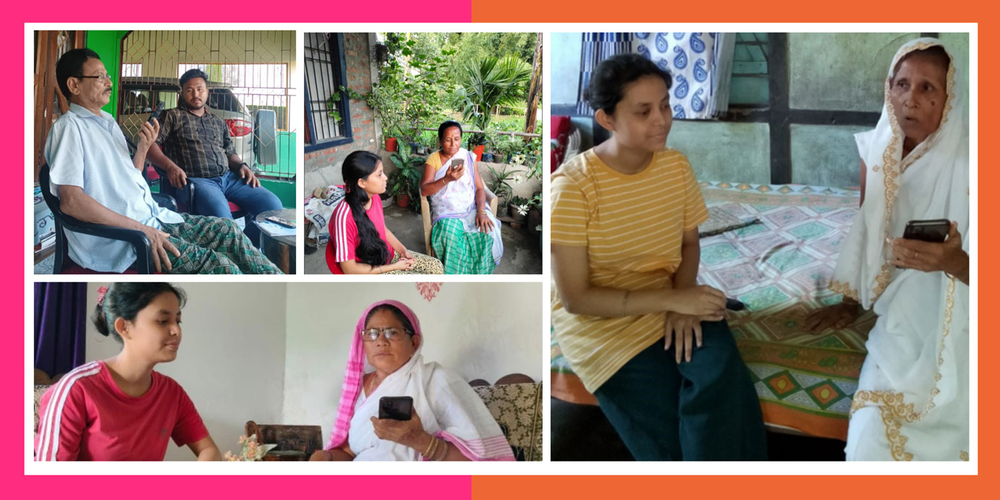

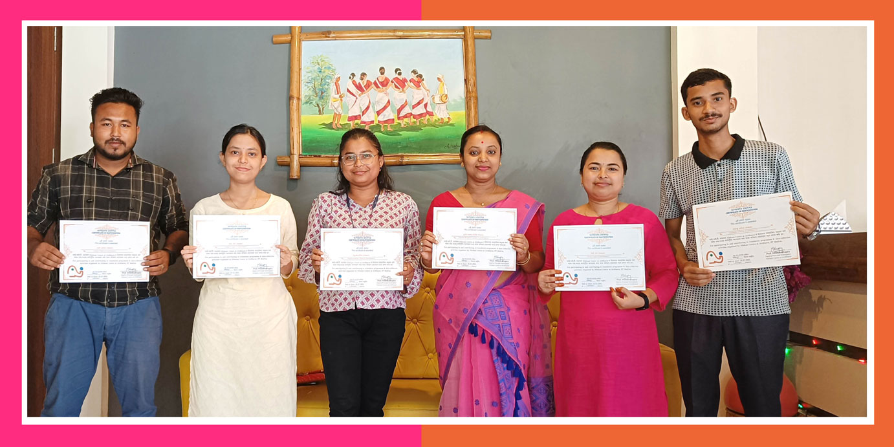

## Bengali Data Collection - Birbhum, West Bengal
Welcome to the heart of Bangla language exploration! Our Calcutta Foundation Pilot team recently set out on a venture in the scenic Birbhum District, Santiniketan town, West Bengal, for the Bengali Data Collection workshop. From the comfortable booths in the local school to the welcoming homes of the villagers, our team delved into the vibrant tapestry of the Bangla language. Thanks to the support from the school, madrasha principal, and hostel warden, we seamlessly blended technology and tradition, creating a unique and enriching experience.

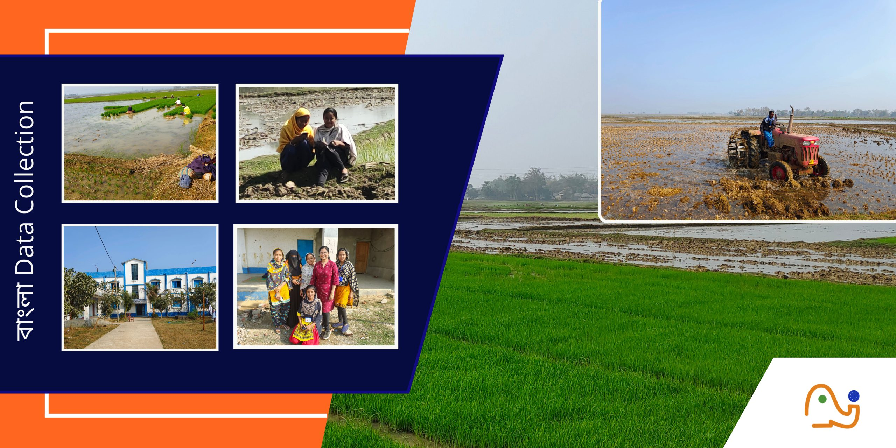

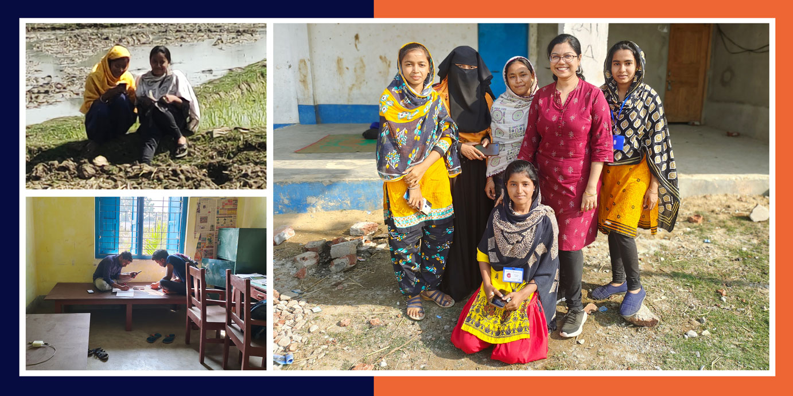

## Odia Tapestry: A Linguistic Odyssey in Sambalpur
Embarking on a captivating journey in the cultural enclave of Sambalpur, the Calcutta Foundation Pilot Team curated the Odia Data Collection Workshop from Jan 10 to Feb 20. Participants, equipped with comprehensive training, immersed themselves in hands-on sessions, testing the app in designated booths. With gracious support from our partner agency, we established recording booths in serene office spaces, capturing the nuances of the Odia language. The workshop thrived on diverse and vibrant participation, celebrating the richness of linguistic expression.

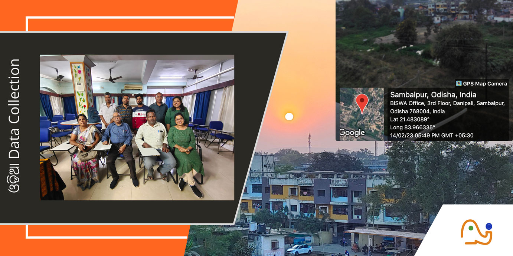

## Harmony of Konkani: A Goa University Tale
In the scenic Goa University Campus from Feb 26 to March 3, the Konkani Data Collection Workshop took place. Led by the Goa University team and guided by professors and staff from the Department of Language and Computer Science, the workshop aimed to collect pilot data for Konkani. It also turned into a celebration of heritage and collaboration.

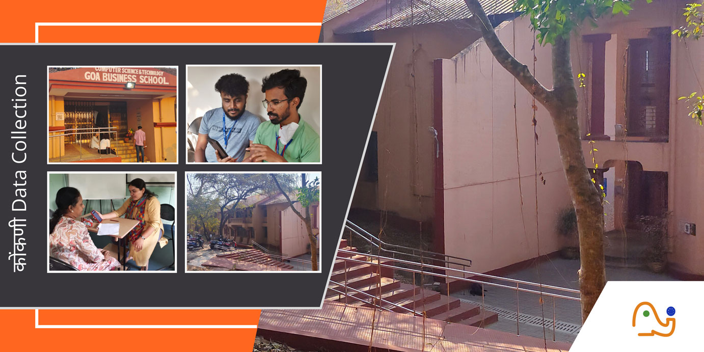

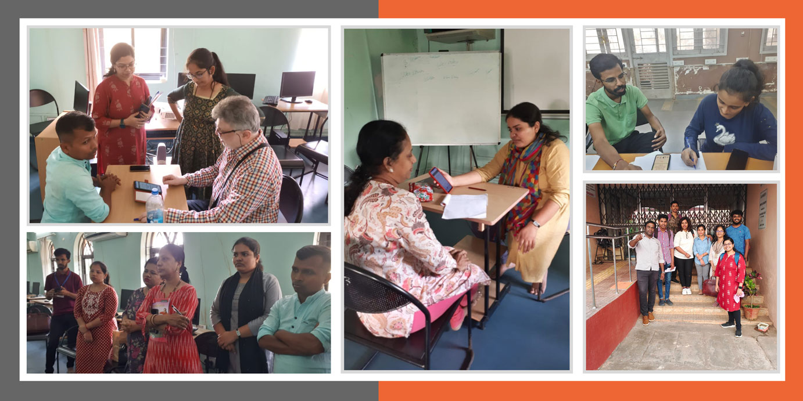

## Bodo Cultural Odyssey in Kokrajhar
In the heart of CIT Campus, Kokrajhar, the Bodo Pilot Team conducted the Bodo Data Collection Workshop from December 5th to 18th. More than just collecting data, the initiative focused on preserving the essence of the Bodo language. Participants, full of enthusiasm, got hands-on experience testing the app in designated booths. CIT Campus generously provided a guest house, accommodating a diverse group of participants. Home visits, especially to elderly participants, added a personal touch to our linguistic journey.

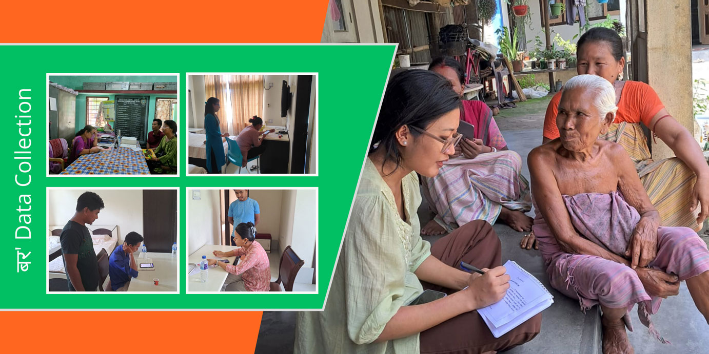

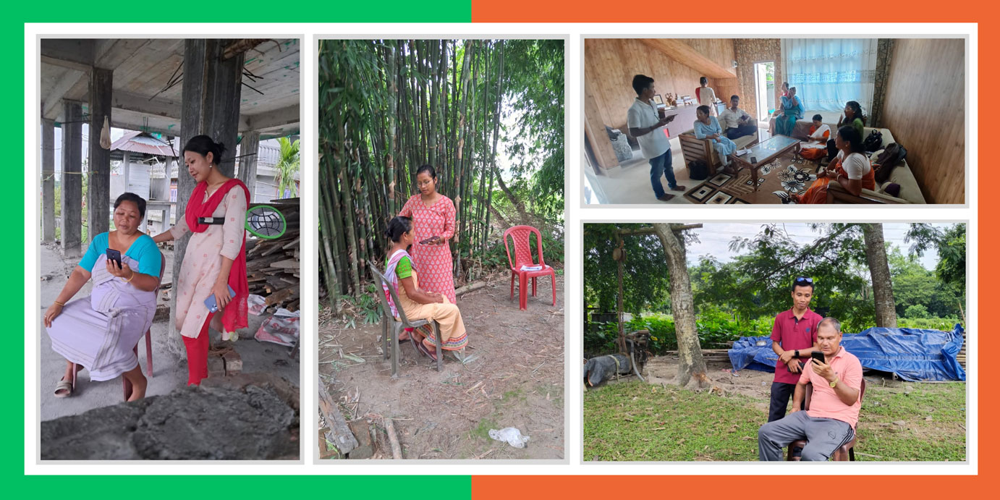

## Bengali Bridging: A Day of Linguistic Brilliance
Calcutta University's Linguistics Department held an energetic One-Day Translation Workshop on June 5th, 2023. This event brought together 50 graduate students for a unique challenge—translating 1,000 sentences from English to Bengali, exploring various aspects of AI ethics. The day marked a significant achievement, with over 40 participants successfully completing the task and receiving remuneration upon review. The Department is now looking forward to future collaborations, making it a day of impactful linguistic exchange.

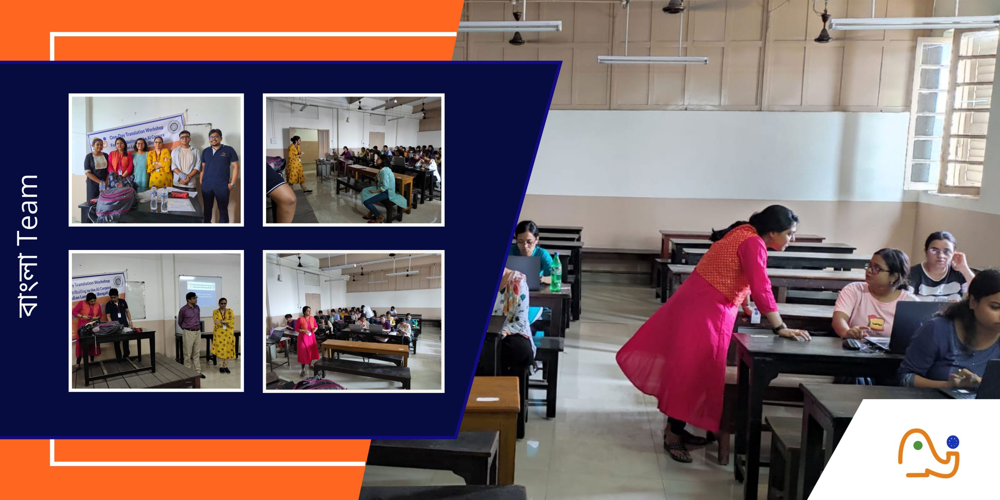

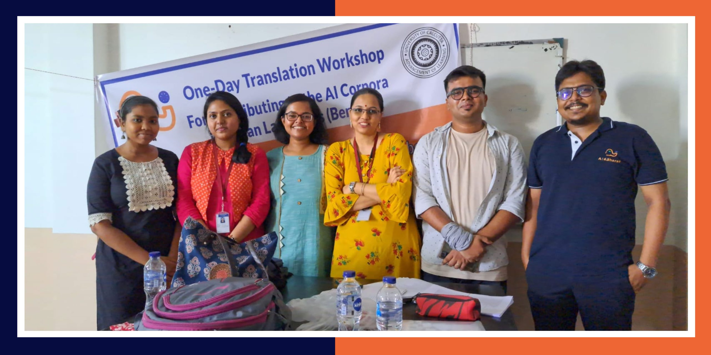

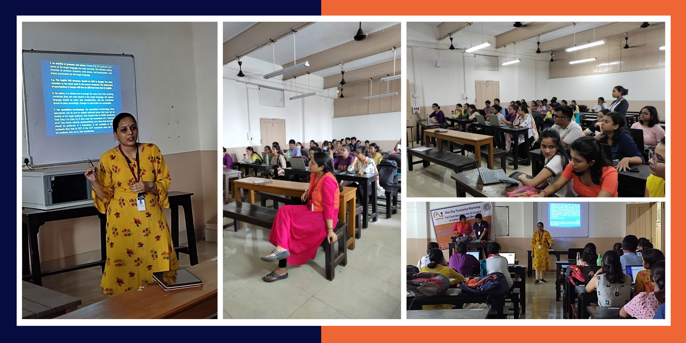

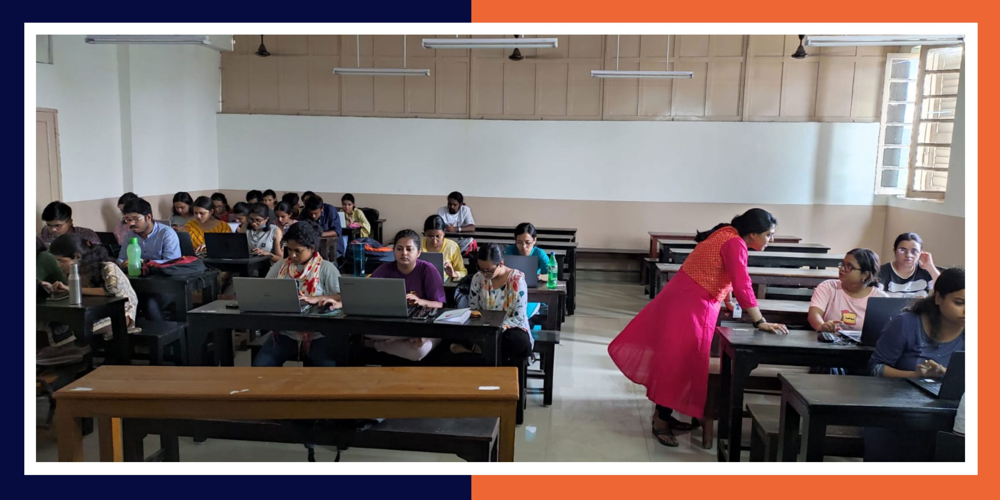

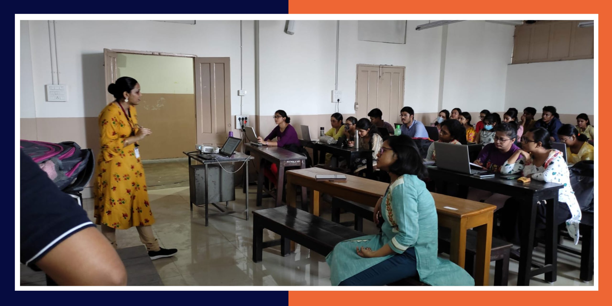

## AI4Bharat's Data Odyssey: Bridging India's Linguistic Tapestry
AI4Bharat set out on a massive data collection journey, unraveling a tale of linguistic diversity across the nation. From the scenic landscapes of North Lakhimpur, where graduate and post-graduate students led the way as coordinators, to the vibrant districts of Kamrup and Kamrup Metro, the initiative captured the essence of India's rich linguistic tapestry. Whether centered in Mirza's bustling hub or spread out in Kamrup Metro, where participants welcomed the project into their homes, this endeavor showcases the resilience and collaborative spirit of AI4Bharat.

# Our Partners
## Aripana Foundation 
Aripana Foundation is a grassroots NGO based in Darbhanga, working towards the development of North Bihar, with a focus on education, primary healthcare and allied areas of development.
"Aripana Foundation is partnering with AI4Bharat to collect voice data, in Maithili and Hindi, across 45 districts in Bihar, UP and Jharkhand."

https://aripanafoundation.org

## DesiCrew Solutions Private Limited
DesiCrew is an Impact Sourcing Company incubated out of IIT-Madras. With over 1200 employees working out of Rural India and collaborating globally with AI teams on Computer Vision and NLP, DesiCrew's award-winning business model is aligned to the United Nations Sustainable Development Goals (UN-SDG). Over 70% of its staff are women, most of whom are first generation knowledge workers. In the Conversational AI space, with around 5 years of field experience, DesiCrew is currently collecting Voice Samples and Audio Annotation in Kannada, Hindi, Gujarati, Malayalam, Marathi, Tamil, Telugu and Urdu covering 238 districts across 14 States.

https://desicrew.in

## NavaData Private Limited
NavaData is actively working as the implementation partner for collecting Speech Data from Odia, Bengali, Hindi, Gujarati, and Marathi languages. Operating across 6 Indian states, they have successfully collected data from over 25 districts for this project. With over 3 years of field experience, the team specializes in collecting, curating, and annotating datasets in Indian languages for ASR training and modeling purposes.

https://navadata.in

## Rekhta Foundation
Rekhta Foundation has partnered with AI4Bharat to work across the length and breadth of India for Speech Data Collection and Annotation of Datasets for Urdu and Sindhi languages.
This partnership draws on Rekhta's language expertise to compile datasets vital for developing Automatic Speech Recognition (ASR) systems.The core philosophy of Rekhta, to Preserve and Promote Indic languages, aligns with this incredible initiative of advancement of Language through Technology. This joint effort underscores a commitment to enhancing digital inclusivity and preserving India’s rich linguistic heritage

https://rekhta.org

## Suchana
Suchana Uttor Chandipur Community Society is an organisation based in rural Birbhum, West Bengal, working in education with mainly Santal adivasi communities. Suchana has partnered with AI4Bharat to anchor the Santali translation and speech data collection, supporting the team to collect data across 20 districts in West Bengal, Assam, Jharkhand, Odisha and Chhattisgarh.

https://suchana-community.org